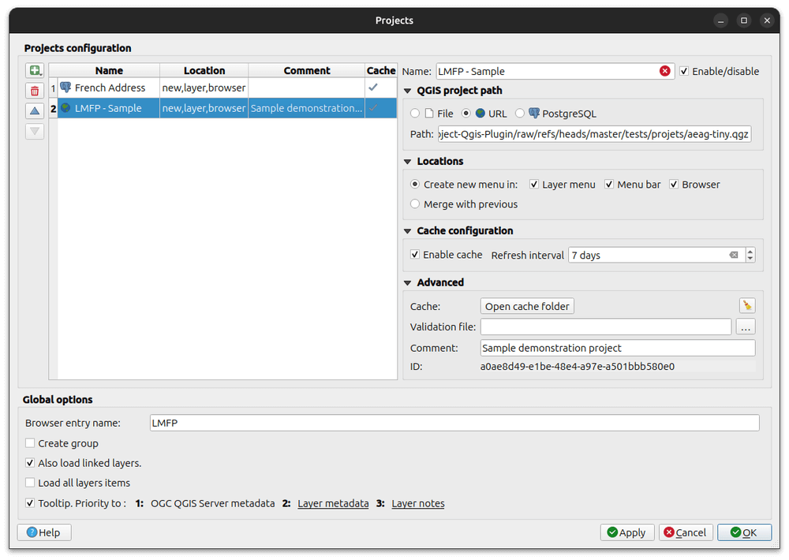

# {{ title }} - Documentation

> **Description:** {{ description }}  
> **Author and contributors:** {{ author }}  
> **Plugin version:** {{ version }}  
> **QGIS minimum version:** {{ qgis_version_min }}  
> **QGIS maximum version:** {{ qgis_version_max }}  
> **Source code:** {{ repo_url }}  
> **Last documentation update:** {{ date_update }}

----

That plugin provides a convenient way to add prestyled and preconfigured frequently used layers using dropdown menus built by simply reading existing QGIS projects (qgs, qgz, postgres, http)

Styling, actions, labeling, metadata, joined layers and relations are reused as defined in source projects.



## Table of contents

```{toctree}
---
maxdepth: 2
caption: Usage
---
usage/en/index
usage/fr/index
usage/how_does_it_works
```

```{toctree}
---
maxdepth: 1
caption: Contributing
---
misc/funding
development/contribute
development/setup
development/documentation
development/translation
development/packaging
development/testing
```

```{toctree}
---
maxdepth: 1
caption: Misc
---
Changelog <misc/history.md>
On QGIS Plugins repository <https://plugins.qgis.org/plugins/menu_from_project/>
```
