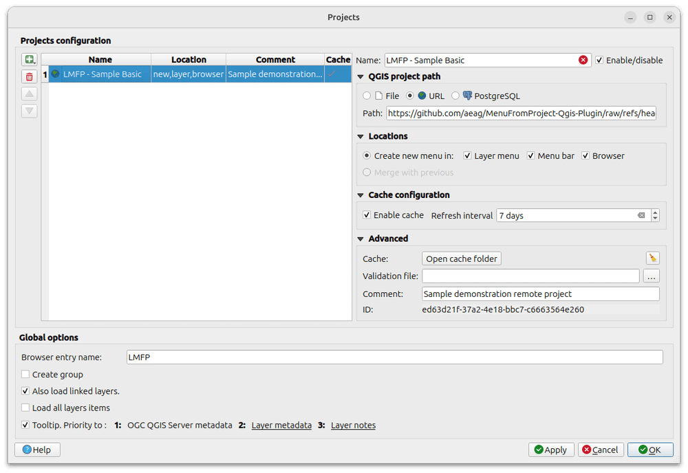
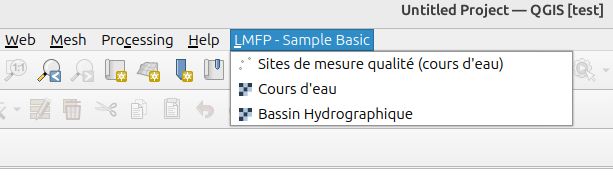
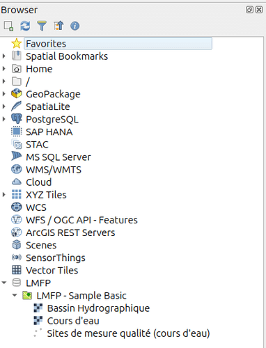
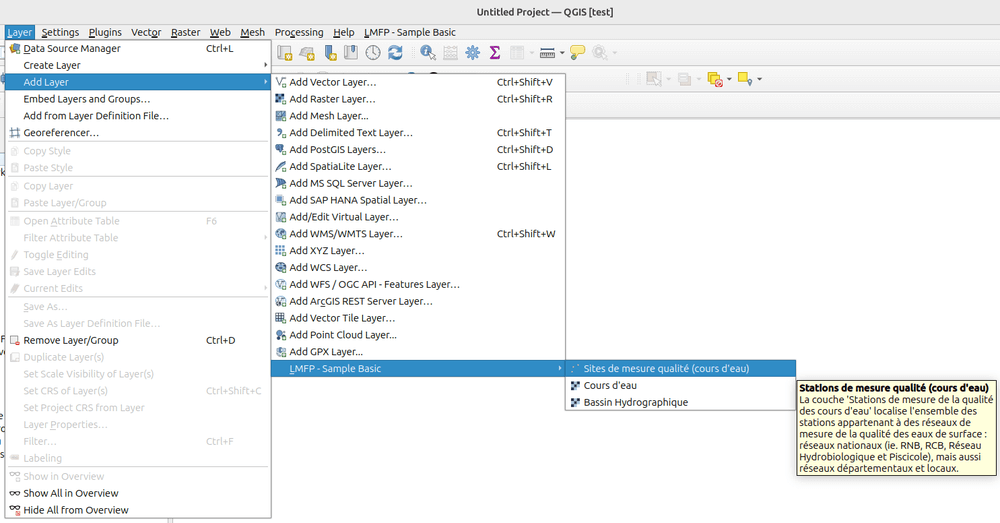

# Try it

Here comes a few of projects to try the plugin which are used to qualify a new version of the plugin after a development cycle.

## Sample remote project: basic

Given the following project URL:

```txt
https://github.com/aeag/MenuFromProject-Qgis-Plugin/raw/refs/heads/master/tests/projects/aeag-tiny.qgz
```

Open the plugin configuration dialog:


Fill it as in the screenshot below and click `Apply` or `OK`:



Check the results:

- [x] added as a new item in QGIS menu bar:

    

- [x] added as a new item in QGIS Browser, named `LMFP`:

    

- [x] added as a new item in `Layer` > `Add Layer menu`:

    
