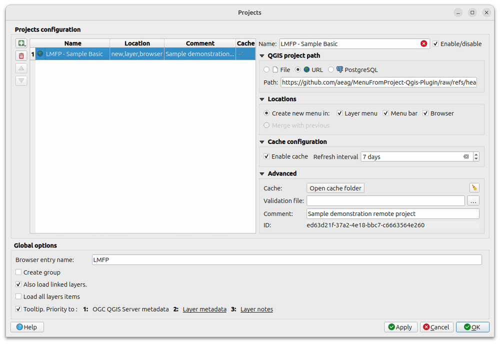

# Essayer le plugin

Voici quelques exemples faciles à utiliser qui servent de référence pour recetter le plugin lors de son développement.

## Exemple de projet distant basique

Prenons l'un des projets QGIS stockés sur le GitHub public du plugin :

```txt
https://github.com/aeag/MenuFromProject-Qgis-Plugin/raw/refs/heads/master/tests/projects/aeag-tiny.qgz
```

Ouvrir l'interface de configuration des projets :


Renseigner les champs comme dans la capture ci-dessous puis cliquer sur `Appliquer` ou `OK`:



Vérifier le résultat :

- [x] le projet apparaît comme un nouveau menu dans la barre de QGIS :

    

- [x] un élément dans l'explorateur de QGIS, nommé`LMFP` :

    

- [x] comme nouvel élément dans le menu `Couche` > `Ajouter une couche`

    
