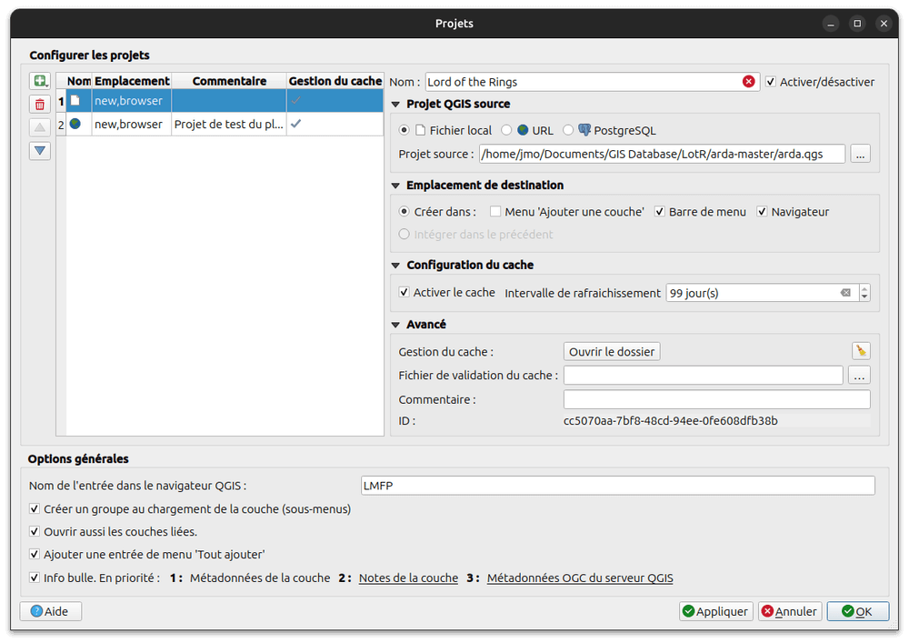

# Utiliser le plugin Layers menu from project

Cette extension pour QGIS permet de construire automatiquement des menus déroulants permettant d'ajouter des couches pré-stylées définies dans des projets QGIS externes "modèles" (qgs, qgz, postgres, web).

Tous les paramètrages des couches, le style, les étiquettes, les actions, les métadonnées, les jointures et relations sont conservées. La maintenance se résume à la gestion de quelques projets QGIS centralisés.


Lorsque le plugin est configuré (choix des projets et attribution d'un nom associé via le menu Extensions - Layers menu from projects), de nouveaux menus apparaissent, pour chacun des projets sélectionnés. Chaque item de menu correspond alors à une couche du projet et déclenche son ouverture.

## 1. Construire de beaux projets

Sauver vos projets sur un espace partagé (réseau, web, postgres) avec leurs styles, leurs étiquettes... une arborescence de groupes à l'image du futur menu.

```{tip}
Créer un groupe vide nommé "-" pour placer un séparateur à cet endroit dans le futur menu.
```

Les projets peuvent être sauvés au format qgz, dans une base PostgreSQL [(cf. feature-saving-and-loading-projects-in-postgresql-database)](https://qgis.org/en/site/forusers/visualchangelog32/index.html#feature-saving-and-loading-projects-in-postgresql-database) ou déposée en tant que ressource web.

```{note}
Le projet placé dans un espace partagé du réseau, sous postgres ou un serveur web permettra à différents utilisateurs d'exploiter les mêmes ressources (à condition bien sûr que celles-ci soit accessible).
```


----

## 2. Configurer le plugin

1. menu `Extensions` / `Layer menu from project` :

    

1. L'interface de configuration s'ouvre :

    

1. Cliquer sur `+` pour ajouter un projet .qgs, .qgz à la liste, ou coller l'URI d'un projet PostgreSQL ou coller l'URL d'un projet distant. ex : <https://adour-garonne.eaufrance.fr/upload/DATA/SIG/aeag-web.qgz>
1. Il est possible de donner un alias qui deviendra le nom du menu. Sion c'est le titre du projet qui est utilisé.

Le nom (modifiable), deviendra le titre du menu.

Le menu pourra être placé soit dans la barre de menu principale, soit dans le sous-menu "couche / ajouter une couche", ou encore (depuis la version 1.1) d'être fusionné avec le projet précédent dans un même menu.

### Options

#### Option de menu 'Tout ajouter'

Si elle est cochée permet de charger l'ensemble des couches d'un même niveau de sous-menu :


#### Créer un groupe au chargement de la couche

Place la nouvelle couche sous un groupe portant le nom du menu :


#### Ouvrir aussi les couches liées

Si des relations ou jointures sont définies, l'ouverture d'une couche s'accompagnera de l'ouverture des couches filles associées.

#### Afficher titre et résumé

Option qui parle d'elle-même.

#### Masquer la fenêtre de configuration du plugin

Vous pouvez cacher la fenêtre d'administration du plugin en ajoutant une variable `menu_from_project/is_setup_visible` à `false` dans le fichier INI de QGIS. Ceci est utile quand QGIS est déployé au sein d'une organisation.
